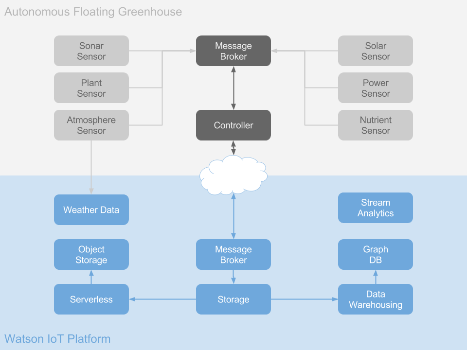

# AFG Architecture

AFGs have an intentionally simplistic architecture. The basic components are
`Sensors` and `Controllers`, both of which are decoupled from one another via
a message broker.

## Sensors

`Sensors` are anything that would be generating hypothetical data aboard an AFG.
Depending on how they are deployed, a `Sensor` can leverage various data sources
to generate more realistic data.

You can find out all you need to know about AFG `Sensors` in the repository
[here](https://github.com/acbodine/afg-sensor)

## Controller

`Controllers` are the brains aboard an AFG. They have a handful of tasks
including:

- running edge analytics on local data streams
- shipping only necessary data to platform
- executing control flow logic that would hypothetically be running on an AFG

You can find out about AFG `Controllers` in the Github repository
[here](https://github.com/acbodine/afg-controller)
